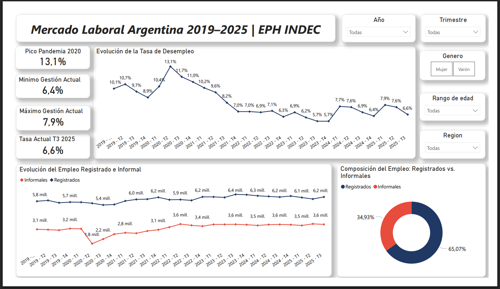
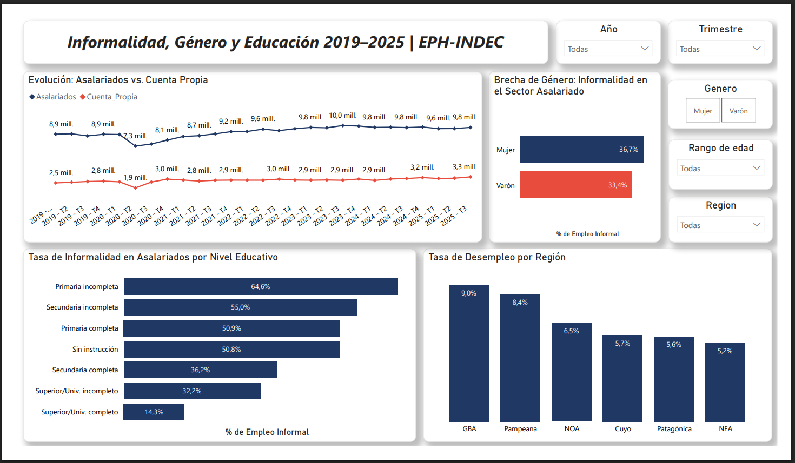
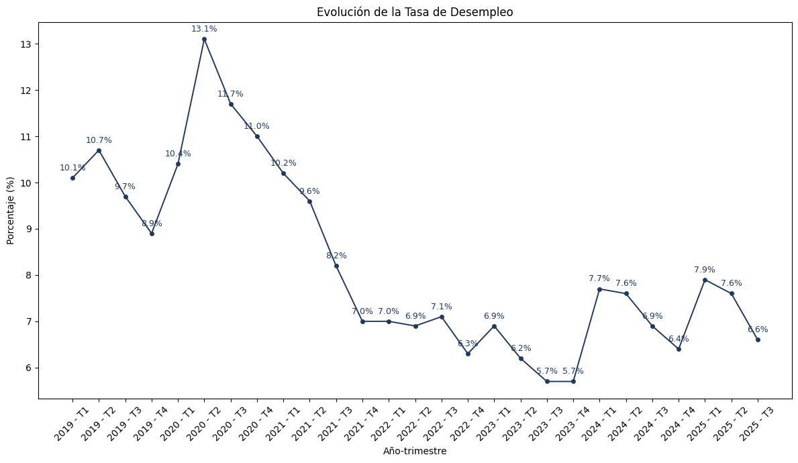
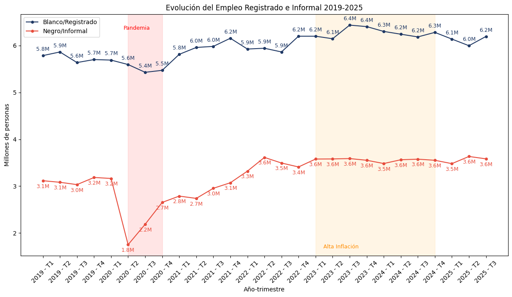
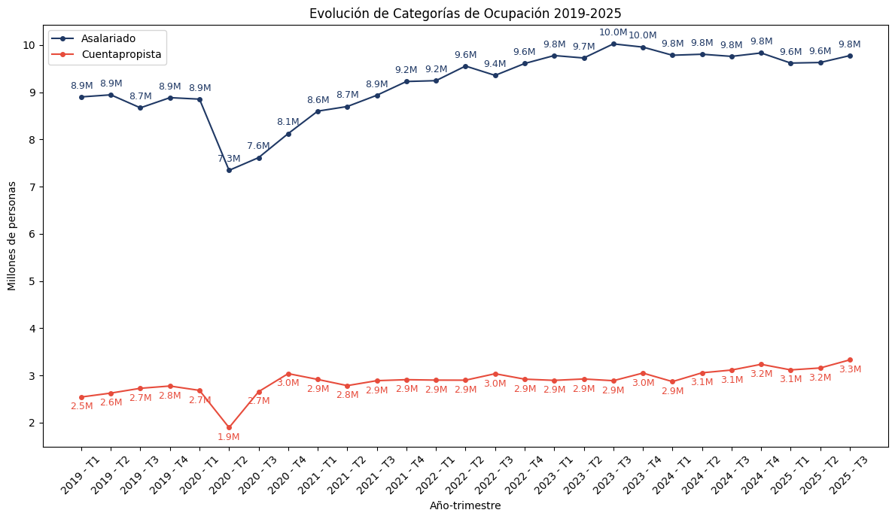
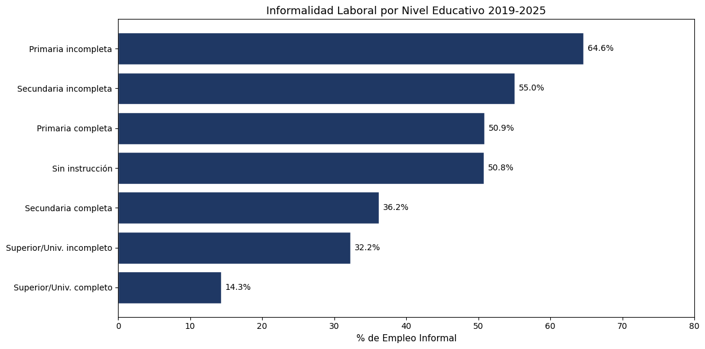
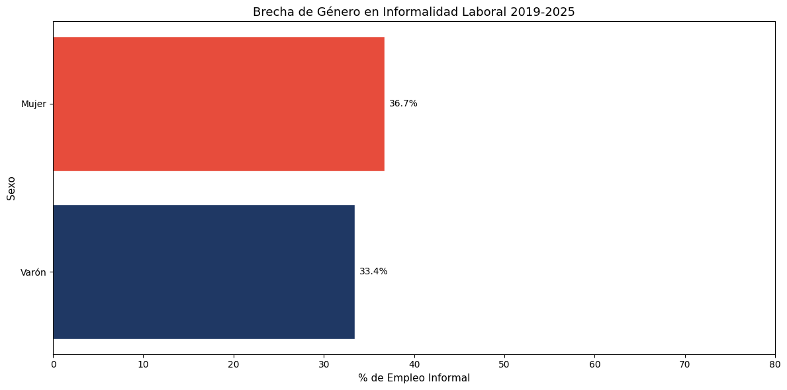
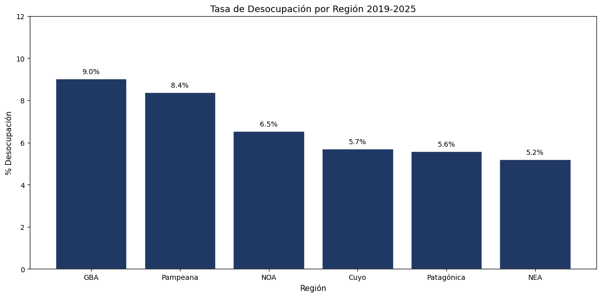

# Análisis del Mercado Laboral Argentino - EPH INDEC 2019–2025

## Flujo de trabajo
- Extracción → Limpieza → Análisis → Visualización → Informe

## Objetivo
Analizar la evolución del mercado laboral argentino entre 2019 y 2025 a partir de los microdatos de la Encuesta Permanente de Hogares (EPH) del INDEC, abarcando el impacto de la pandemia, la recuperación post-COVID y el contexto de alta inflación 2023-2025. El análisis responde 9 preguntas clave sobre desempleo, informalidad asalariada, estructura ocupacional, educación, género y territorio.

## Volumen de datos
- **Volumen bruto:** 1.316.763 filas × 240 variables oficiales
- **Base optimizada:** 1.045.045 registros × 16 variables tras limpieza y curaduría
- **27 trimestres** consecutivos (T1 2019 — T3 2025)
- **31 aglomerados urbanos** de Argentina
- **~23 millones** de personas en edad de trabajar representadas mediante ponderación

## Fuentes de datos
- Microdatos EPH — Encuesta Permanente de Hogares
- Organismo: Instituto Nacional de Estadística y Censos (INDEC)
- Período analizado: T1 2019 — T3 2025
- Cobertura: 31 aglomerados urbanos de Argentina
- Población de referencia: ~23 millones de personas en edad de trabajar
- Fuente oficial: https://www.indec.gob.ar

## Herramientas utilizadas
- **Python**:
  - Extracción y consolidación de 27 trimestres de microdatos
  - Limpieza, transformación y creación de variables derivadas con Pandas
  - Visualización con Matplotlib
- **Power BI**:
  - Modelado de datos con Modelo en Estrella (Star Schema)
  - Creación de medidas dinámicas en DAX
  - Dashboard interactivo con segmentadores por año, trimestre, región, sexo y rango etario

## Nota metodológica
La informalidad laboral se mide sobre la población asalariada mediante la ausencia de descuento jubilatorio (`PP07H`). La ponderación (`PONDERA`) se aplica en todos los cálculos para expandir la muestra a la población real.

## Gráficos destacados

## Informe completo
Podés ver el informe completo del proyecto en formato PDF:  
[Informe Análisis Mercado Laboral Argentina - EPH INDEC](./reports/Informe_EPH_INDEC_2019_2025.pdf)

**Autor:**  
**Matías Costa**  
Data Analyst | Estudiante de Licenciatura en Informática  
Año: 2026